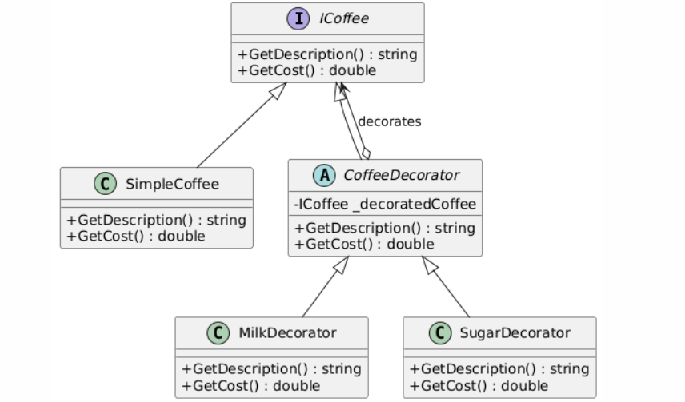

# Decorator Design Pattern Example

## Overview

The Decorator Design Pattern is a structural design pattern that allows for the dynamic addition of behavior to objects. It is used to extend the functionalities of objects in a flexible and reusable manner without modifying their existing code.

## Purpose

This project provides a clear and simple example of the Decorator Design Pattern, demonstrating how to add functionalities to objects using decorators.

## How It Works

1. **Component**: Defines the interface for objects that can have responsibilities added to them dynamically.
2. **Concrete Component**: Implements the base functionality of the component.
3. **Decorator**: Abstract class that implements the component interface and has a reference to a component object.
4. **Concrete Decorators**: Extend the functionality of the component by adding new responsibilities.

## Decorator Design Pattern Example in Coffee Ordering

## Overview

This example demonstrates the Decorator Design Pattern through a coffee ordering system. The pattern allows us to dynamically add features to a coffee order, such as milk and sugar, without modifying the base coffee class.

## Components

### Component Interface: `ICoffee`

- Defines the methods that concrete components and decorators must implement.
- **Methods:**
  - `GetDescription()`: Returns a description of the coffee.
  - `GetCost()`: Returns the cost of the coffee.

### Concrete Component: `SimpleCoffee`

- Implements the `ICoffee` interface.
- Provides a basic coffee description and cost.
- **Description:** "Simple Coffee"
- **Cost:** 5.0 (base cost of coffee)

### Decorator: `CoffeeDecorator`

- Abstract class that implements the `ICoffee` interface and contains a reference to an `ICoffee` object.
- **Methods:**
  - `GetDescription()`: Returns the description of the wrapped coffee object.
  - `GetCost()`: Returns the cost of the wrapped coffee object.

### Concrete Decorators:

- **`MilkDecorator`**

  - Inherits from `CoffeeDecorator`.
  - Adds milk to the coffee.
  - **Description:** Appends ", Milk" to the base description.
  - **Cost:** Adds 3 to the base cost of the coffee.

- **`SugarDecorator`**
  - Inherits from `CoffeeDecorator`.
  - Adds sugar to the coffee.
  - **Description:** Appends ", Sugar" to the base description.
  - **Cost:** Adds 2 to the base cost of the coffee.

## Usage

1. **Create a Simple Coffee:**

   - Instantiate `SimpleCoffee`.
   - **Output:** Shows the description "Simple Coffee" and its cost (5.0).

2. **Add Milk:**

   - Wrap the `SimpleCoffee` instance with `MilkDecorator`.
   - **Output:** Shows the description "Simple Coffee, Milk" and the updated cost (8).

3. **Add Sugar:**
   - Wrap the coffee instance (now with milk) with `SugarDecorator`.
   - **Output:** Shows the description "Simple Coffee, Milk, Sugar" and the updated cost (10).

## UML Diagram

## Environment

The project builds and runs with Visual Studio Community 2022 when the required workloads are installed.
